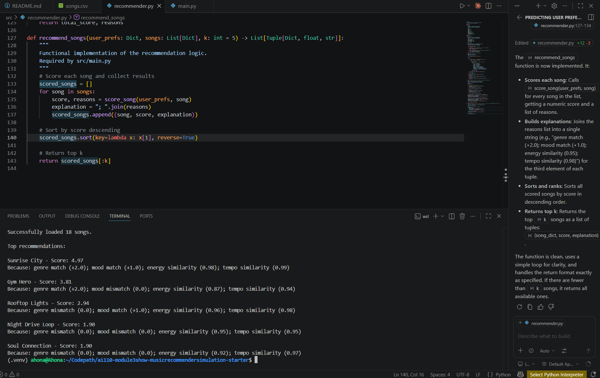
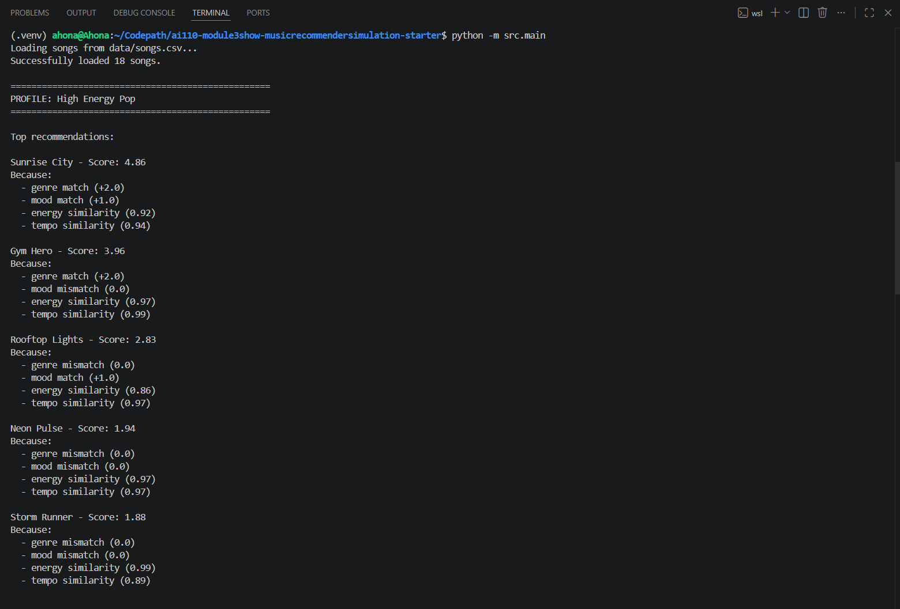
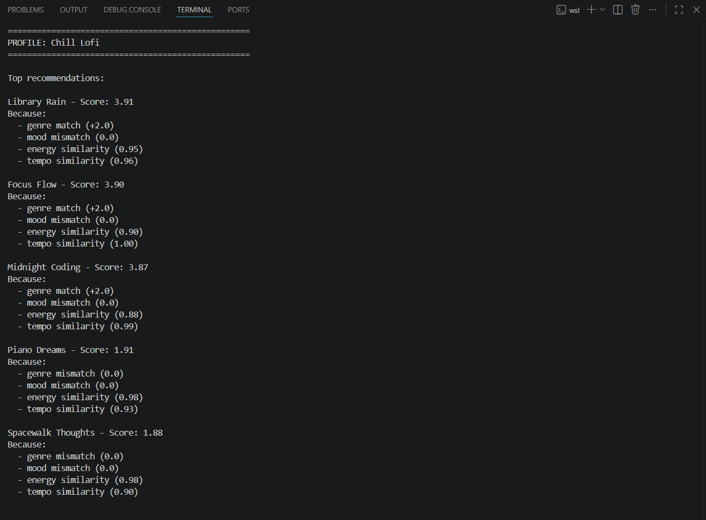
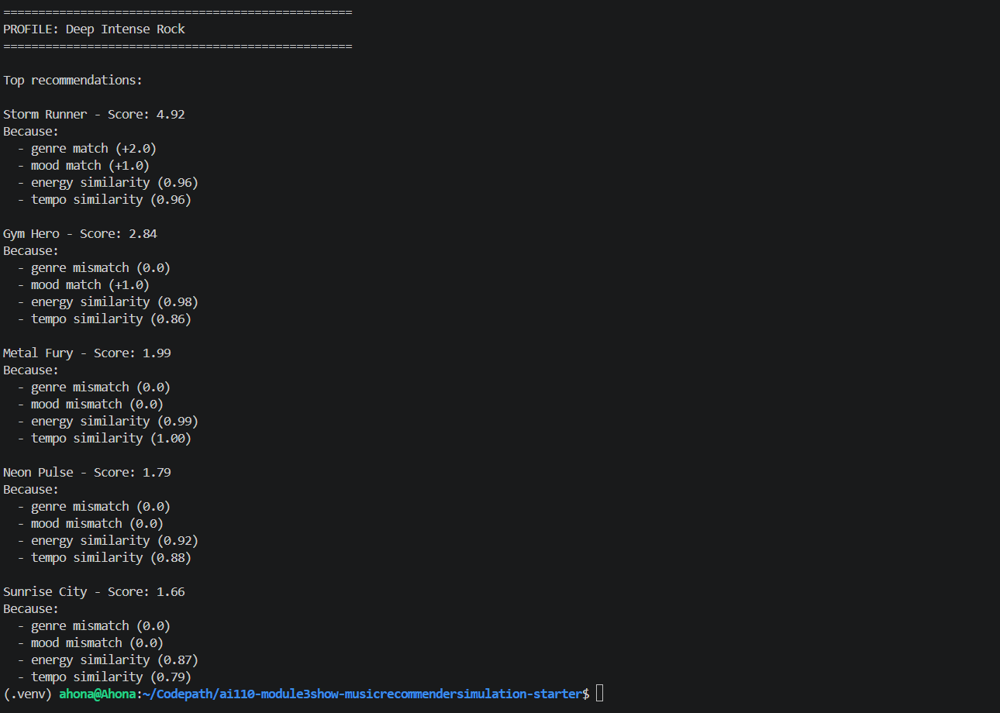

# 🎵 Music Recommender Simulation

## Project Summary

In this project you will build and explain a small music recommender system.

Your goal is to:

- Represent songs and a user "taste profile" as data
- Design a scoring rule that turns that data into recommendations
- Evaluate what your system gets right and wrong
- Reflect on how this mirrors real world AI recommenders

In this project, I built a simple music recommender system that suggests songs based on user preferences like genre, mood, energy, and tempo. The system compares each song’s features to a user profile and assigns a score to determine how well they match. It then ranks songs from highest to lowest score and recommends the top results. This project demonstrates how real-world recommendation systems use data and weighted scoring to generate personalized suggestions.

---

## How The System Works

Explain your design in plain language.

Some prompts to answer:

- What features does each `Song` use in your system
  - For example: genre, mood, energy, tempo
- What information does your `UserProfile` store
- How does your `Recommender` compute a score for each song
- How do you choose which songs to recommend

You can include a simple diagram or bullet list if helpful.


This system is a simple content-based recommender. It suggests songs to a user by comparing the features of each song to the user's preferences.. Each 'Song' in the system has features such as genre, mood, energy, and temp_bpm. These features help describe the overall "vibe" of the song. For example, energy and temp help capture how fast or intense a song feels, while genre and mood dedcribe its style and emotional tone. The 'UserProfile' stores the user's preferences for these same features. This includes their desired genres, mood, and target values for numbered features like energy or tempo. These preferences represent what kind of music the user enjoys. The 'Recommender' calculates a score for each song by comparing the song's features to the user's preferences. Songs get higher scores when they are more similar to the user's taste. For example, if a song's energy level is close to the user's preffered energy, it will recieve a higher score. Matching categories like genre or modd can also add more points. Different features maybe weighted differently depending on how important they are. After calculating scores for all songs, the system ranks them from highest to lowest score. The top ranked songs are then recommended to the user, since they are the closest match to the user's preferences.


Algorith Recipe:
- _2.0 points if the song's genre matches the user's favorite genre
- +1.0 point if the song's mood matches the user's favortie mood 
- Add a similarity score for energy based in how close the song's energy is to the user's target energy 
- Add a similarity score for tempo chased on how close the song's tempo is to the user's target tempo. 

After calculating scores for all songs, teh system ranks them from highest to lowest. The top ranked songs are then recommended to the user. 

System Flow:
Input (User Preferences) : Process (Loop through songs and calculate scores) , then Output: (Rank songs and return top recommendations)

Design Improvement: 
The User profile was redefined after testing. Firstly, the songs from other genres such as rock, could score highly if they matched energy and mood. To fix this, a target tempo was added and genre was given a higher weight. This helps the system better distinguish between the different types of music. 

Potential Bias: This system might actually give more attention to the genre, which could cause it to ignore songs that match the user's mood or energy but belong to a different genre. 

---

## Getting Started

### Setup

1. Create a virtual environment (optional but recommended):

   ```bash
   python -m venv .venv
   source .venv/bin/activate      # Mac or Linux
   .venv\Scripts\activate         # Windows

2. Install dependencies

```bash
pip install -r requirements.txt
```

3. Run the app:

```bash
python -m src.main
```

### Running Tests

Run the starter tests with:

```bash
pytest
```

You can add more tests in `tests/test_recommender.py`.

---

## Experiments You Tried

Use this section to document the experiments you ran. For example:

- What happened when you changed the weight on genre from 2.0 to 0.5
- What happened when you added tempo or valence to the score
- How did your system behave for different types of users


I ran the recommender with a default pop/happy user profile and noticed that songs matching genre and mood were ranked highest. Energy and tempo helped fine-tune the ordering of results. Below is a screenshot of the output: 




I tested my recommender system using multiple edge case user profiles to evaluate how well the scoring logic adapts to different types of musical preferences. 

This is the High Energy Pop


This is Chill Lofi


This is Deep Intense Rock 

---

## Limitations and Risks

Summarize some limitations of your recommender.

Examples:

- It only works on a tiny catalog
- It does not understand lyrics or language
- It might over favor one genre or mood

You will go deeper on this in your model card.

One limitation of this recommender is that it relies deeply on a small number of features (genre, mood, energy,a nd tempo). Because of this,different user profiles can sometimes recieve similar reccomendations if songs share overlapping feature values.  Another limitation is that the dataset is small and may overrepresent certain genres, which can bias the results toward those genres regardless of user preference strength. 


---

## Reflection

Read and complete `model_card.md`:

[**Model Card**](model_card.md)

Write 1 to 2 paragraphs here about what you learned:

- about how recommenders turn data into predictions
- about where bias or unfairness could show up in systems like this

Through this project, I learned how recommendation systems covert user preferences and item featues into numerical scores. Even simple wighted scoring systems can create meaningful rankings that resemble the real-worl platforms like Spotify. Howver, I also learned that these systems are highly sensitive to design choices like feature selection and weighting. Small changes in weights can change the recommendations, which shows how bias and over-priortization of certain feautres can easily appear in recommender systems.
---

## 7. `model_card_template.md`

Combines reflection and model card framing from the Module 3 guidance. :contentReference[oaicite:2]{index=2}  

```markdown
# 🎧 Model Card - Music Recommender Simulation

## 1. Model Name

Give your recommender a name, for example:

> VibeFinder 1.0

---

## 2. Intended Use

- What is this system trying to do
- Who is it for

Example:

> This model suggests 3 to 5 songs from a small catalog based on a user's preferred genre, mood, and energy level. It is for classroom exploration only, not for real users.

---

## 3. How It Works (Short Explanation)

Describe your scoring logic in plain language.

- What features of each song does it consider
- What information about the user does it use
- How does it turn those into a number

Try to avoid code in this section, treat it like an explanation to a non programmer.


The model works by comparing each song’s features with a user’s preferences. It uses genre and mood matches as categorical signals and calculates similarity scores for numerical features like energy and tempo. Each match contributes to a total score, and songs with higher scores are ranked higher. The final recommendations are the top-scoring songs after all comparisons. This is a simplified version of real-world recommender systems that use weighted scoring.
---

## 4. Data

Describe your dataset.

- How many songs are in `data/songs.csv`
- Did you add or remove any songs
- What kinds of genres or moods are represented
- Whose taste does this data mostly reflect


The dataset contains a small collection of songs stored in a CSV file with about 18 songs. Each song includes features such as genre, mood, energy, tempo, valence, danceability, and acousticness. The dataset includes a limited range of genres and moods, so it does not represent all types of music. No data was removed, but additional synthetic songs were added to increase variety. Some aspects of musical taste, such as lyrics and cultural context, are not included.
---

## 5. Strengths

Where does your recommender work well

You can think about:
- Situations where the top results "felt right"
- Particular user profiles it served well
- Simplicity or transparency benefits


The system works well for simple and clearly defined user preferences, such as high-energy pop or calm chill music. It correctly identifies songs that match strong feature patterns like high energy or matching mood. The scoring system is transparent, so it is easy to understand why a song was recommended. It performs especially well when user preferences align closely with available song features.

---

## 6. Limitations and Bias

Where does your recommender struggle

Some prompts:
- Does it ignore some genres or moods
- Does it treat all users as if they have the same taste shape
- Is it biased toward high energy or one genre by default
- How could this be unfair if used in a real product

The recommender system only uses a few features like genre, mood, energy, and tempo. Because of this, it does not capture more detailed aspects of music such as lyrics or emotional meaning. Some genres or moods may be overrepresented in the dataset, which can create bias in recommendations. The scoring system can also over-prioritize certain features depending on the weights. This can cause different users to receive similar recommendations even when their preferences are different.

---

## 7. Evaluation

How did you check your system

Examples:
- You tried multiple user profiles and wrote down whether the results matched your expectations
- You compared your simulation to what a real app like Spotify or YouTube tends to recommend
- You wrote tests for your scoring logic

You do not need a numeric metric, but if you used one, explain what it measures.

I tested the recommender using different user profiles such as High Energy Pop, Chill Lofi, and Deep Intense Rock. The system produced different rankings for each profile, showing that it responds to changes in user preferences. I looked at whether the top songs matched the expected mood, genre, and energy levels. One thing I noticed was that some songs appeared across multiple profiles, especially when they had balanced feature values. Overall, the results made sense but showed limitations in personalization due to the simple scoring system.

---

## 8. Future Work

If you had more time, how would you improve this recommender

Examples:

- Add support for multiple users and "group vibe" recommendations
- Balance diversity of songs instead of always picking the closest match
- Use more features, like tempo ranges or lyric themes

Future improvements could include adding more songs to improve diversity and reduce bias. The system could also use additional features like lyrics or listening history. Another improvement would be introducing diversity in recommendations so results are not too similar. The scoring system could also be improved by learning weights automatically from user feedback.

---

## 9. Personal Reflection

A few sentences about what you learned:

- What surprised you about how your system behaved
- How did building this change how you think about real music recommenders
- Where do you think human judgment still matters, even if the model seems "smart"

This project helped me understand how recommendation systems convert user preferences into ranked outputs using weighted scoring. I learned that even simple systems can produce realistic recommendations. I was surprised by how small changes in weights can significantly change the results. This made me realize how sensitive recommendation systems are to design choices. It also helped me understand how real platforms like Spotify may prioritize different features to influence what users see.